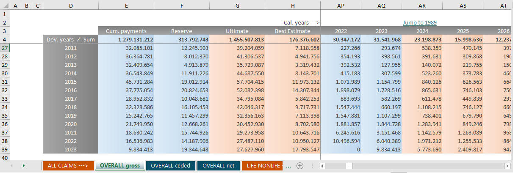

## Introduction
### Motivation
This package implements the stochastic individual claims reserving (sicr) that was first published by Dirk Skowasch and Torsten Grabarz (see 08.03.2022 on <https://www.qx-club.de/ARCHIV/>). It is based on the paper of [Murphy & McLennan](<https://www.casact.org/sites/default/files/database/forum_06fforum_209.pdf>) but extends it in some areas for better applicability under Solvency II. 

The basic idea is that the year-to-year development of every single large claim is sampled from a pool of historic observations of similar claims. Repeating this will lead to a monte carlo simulation from which best estimates for future gross and reinsurance payments can be derived.

The most significant extensions and differences to Murphy/McLennan are

- the use of reserve classes to classify open claims.
- the focus on absolute payments instead of development factors, thus indexation is required.
- the consideration of annuities.

This vignette offers a step by step guide to use the package. It also includes some technical explanations, but does not offer a detailed description of the method. This can instead be found in the above linked article.

### Installation
kommt noch

## Setup
The following packages need to be loaded:
```{r setup, warning = FALSE, message = FALSE}
library(sicr)
library(dplyr)
```

```{r, echo = FALSE, warning = FALSE, message = FALSE}
out <- function(df) {
   if (is.data.frame(df)) {
      return(DT::datatable(df, options = list(scrollX = TRUE, paging = TRUE)) %>%
                DT::formatRound(columns = grep("eserve|ayment|ncurred|Priority|Limit", 
                                      names(df), 
                                      ignore.case = TRUE, 
                                      value = TRUE), 
                       digits = 0) %>%
                DT::formatRound(columns = grep("Transition|Probability|Dynamic|Index|Margin|Quota_share", 
                                      names(df), 
                                      ignore.case = TRUE, 
                                      value = TRUE), 
                       digits = 3)
            
            )}
   if (is.matrix(df)) {
      return(DT::datatable(df, options = list(scrollX = TRUE, scrollY = "400px", paging = FALSE)) %>%
         DT::formatRound(columns = 1:NCOL(df),
                     digits = 0))}
   
}
```


## General information in advance
### Payment and reserve matrices
At some points development triangles are used and filled up to rectangles. 

This package (with very few exceptions) always uses the **calendar year representation**, which means that rows represent origin years and columns represent calendar years. 

Payment entries are always **incremental**. Reserve entries resemble the reserve at the end of the column's calendar year.

A triangle might look like this:
```{r}
all_claims_paid_xmpl[29:35,29:35]
```


### Dividing into small, large and special claims
A claim is considered **large** if its cumulated indexed payments plus its latest indexed reserve exceed the chosen threshold. \
**Note that only payments after and in the year that the claim exceeded the threshold will be considered as large claim payments. All payments before belong to small claims.** \
Large claims payments are projected with the stochastic individual claims reserving method. 

Some claims might be extraordinarily large (or *different* in any other way) so that there haven't been enough similar historic observations that can be used to project them with. These claims are called **special claims**. They are seperated from the rest and projected deterministically (see description below).

We obtain small claims payments and reserves triangles by subtracting large and special claims' development triangles from the overall development triangles.

### Annuities
In some countries it is common to convert recurring payments into annuities. Usually the actuary then gets access to some additional biometric information about the annuity recipient that can be used to improve the estimate of future payments. This package allows for the separate treatment of annuities, but some extra input dataframes and matrices will be required. In that case, dataframe columns like `Cl_payment_cal` (for claims payments in one specified calendar year) do not include annuity payments as they are included in `An_payment_cal`. 
If annuities are irrelevant or are considered as common claim payments, all annuity columns must be 0 and the annuity dataframes can be set to NULL.

### IBNR claims
IBNR claims are calculated as described in the paper with an additive method for the **number** and a sampling from historic IBNR large claims for the **amount** of each expected claim.
Two parameters need to be selected as input for the IBNR method:

1. The dataframe `exposure` will be used for the additive method and is described below. 
2. The vector `years_for_ibnr_pools` contains the calendar years that shall be used to build the pools to sample the amount from.

Both parameters will be needed in the function `sicr()`. They may also be NULL, in that case a constant exposure and all observed calendar years will be used. 

### Reinsurance
The method can be applied on a gross basis without reinsurance by setting the `reinsurance` dataframe to NULL, but this would deprive the method of one of its main advantages. If reinsurance shall be included, the help of the function `xl_cashflow()` provides detailed information about how the dataframe `reinsurance` needs to be structured. Furthermore, the dataframe `historic_indices` resp. `indices` must contain the column `Index_re`, see help of `indices_xmpl`.


### Matrix naming convention
With the above stated, it is useful to introduce a naming convention:

A payments or reserve matrix' name consists of three parts, each separated by an underline, e.g. `large_claims_paid`. 

1. The first part is one of 
   - `all` 
   - `small` 
   - `large` or 
   - `special` \
   and describes where the claim belongs to. \
2. The second part is either 
   - `claims` or 
   - `annuities` \
   depending on whether the payment (or reserve) is a pure claims payment (that means without annuity payments) or an annuity payment. \
It can also be one of 
   - `known_annuities` and 
   - `future_annuities` \
if annuity payments are split into these two parts as in small and large claims. \
It can furthermore be one of 
   - `ibnr` for IBNR claims 
   - `ceded_xl` for reinsurance share of xl treaties or 
   - `ceded_quota` for reinsurance share of quota share treaties. \
   Note that the latter three don't seperate into claims' and annuities' payments. \
3. The third part is one of `paid`, `reserved`, `prediction` and `payments` where
   - `paid` is the upper right triangle of historic payments.
   - `reserved` is the upper right triangle of historic reserves. Note that no reserves will be projected so there is no need to divide historic from future reserves matrices.
   - `prediction` is the matrix of future payments. It always consists of the origin years as rows and **250 future calendar years** as columns. Of course non-null payments end at the latest at around 100 to 120 years, but due to technical reasons, this long duration had to be set. 
   - `payments` is the binding of `paid` and `prediction`.

## General parameters
The following parameters are required to prepare the data. Some more parameters are described in the corresponding sections.

### first_orig_year
The first origin year for which the entire history is available, that is each payment and reserve per year from the origin year until now.
```{r}
first_orig_year <- 1989
```

### last_orig_year
The latest observed calendar year.
```{r}
last_orig_year <- 2023
```

### threshold
The threshold divides small from large claims. Every claim that exceeded this value once by its indexed payments and reserves is defined as a large claim.
```{r}
threshold <- 400000
```

### reserve_classes
This vector is used to map the reserve of a claim to a reserve class. 
```{r}
reserve_classes <- c(1, 200001, 400001, 700001, 1400001)
```

This leads to

- reserve class 0 for reserves < 1
- reserve class 1 for 1 <= reserves < 200001

and so on.

## Input dataframes and matrices
Every required dataframe or matrix is well documented in the functions where it is used and has an example delivered with this package which is named by the suffix *_xmpl*. As these data tend to be quite large, some dataframes are also delivered in a minimal version with the prefix *minimal_* to show the functionalities in the clearest possible way.

### claims_data
The most crucial dataframe is the `claims_data` dataframe. 

It must contain one row for each calendar year per claim where at least one of the columns `Cl_payment_cal`, `Cl_reserve`, `An_payment_cal` and `An_reserve` is not 0. 

`claims_data` must contain each claim that occured between `first_orig_year` and `last_orig_year` that may be large **after indexation**. To take indexation into account, chose an internal threshold for your data extraction that is significantly smaller than the threshold that shall be used here. 

`claims_data` may also contain all small claims, but this will slow down the data preparation process.

To consider older claims (`origin year < last_orig_year`) for which history is only available from `first_orig_year` until now, add one row for this claim for calendar year `first_orig_year - 1` and fill `Cl_payment_cal` and `An_payment_cal` with the **cumulated payments** up to that year and `Cl_reserve` and `An_reserve` with the reserve at the end of `first_orig_year - 1`. This allows for checking if a claim belongs to large or small claims. Due to the missing first part of the history the development year of growing large can't be determined for these claims. Thus, an additional parameter `Dev_year_of_growing_large` is required, the average development year in which a claim exceeds the threshold. See details of the function `prepare_data()` for more information.

The dataframe must look like this:
```{r}
out(head(claims_data_xmpl, 1000))
```

See description of `claims_data` in details section of `?prepare_data()` for more information.

Check your created dataframe for implausible entries or wrong formats:
```{r}
claims_data_ok(claims_data_xmpl, last_orig_year)
```


### active_annuities
This dataframe contains each annuity that is still active at the end of `last_orig_year`. The function `sicr()` will assign a random death year for every annuity in every realisation and project the arising annuity payments.

The dataframe must look like this:
```{r}
out(active_annuities_xmpl)
```

See `?active_annuities_xmpl` for more detailled information about the required structure of the dataframe.

Check your created dataframe for implausible entries or wrong formats:
```{r}
active_annuities_ok(active_annuities_xmpl, last_orig_year)
```

### pool_of_annuities
This dataframe contains every annuity that has been created between `first_orig_year` and `last_orig_year`. It will be used to project late annuities for large claims and small claims.

The dataframe is very similar to `active_annuities` but the column `Calendar_year` must be equal to `Entering_year`:
```{r}
out(pool_of_annuities_xmpl)
```
See description of `pool_of_annuities` in details section of `?prepare_data()` for more information.

Check your created dataframe for implausible entries or wrong formats:
```{r}
pool_of_annuities_ok(pool_of_annuities_xmpl)
```

#### Remark
As the structure of `active_annuities` and `pool_of_annuities` is identical, it is reasonable to create one dataframe that contains each calendar year status of every observed annuity and filter that dataframe for example like this:
```{r, eval = FALSE}
pool_of_annuities <- dplyr::filter(all_annuities, 
                                   Entering_year == Calendar_year)
active_annuities <- dplyr::filter(all_annuities, 
                                  Calendar_year == last_orig_year,
                                  Annuity_end > last_orig_year)
```

### mortality
This dataframe contains the mortality probabilities divided by male and female. The dataframe `age_shift` might lead to ages smaller than 0 (see dataframe below). It is necessary that these ages get assigned a mortality probability, too. The probability for the maximum age per gender must be 1.

The datframe might look like this:
```{r}
out(mortality_xmpl)
```
See `?mortality_xmpl` for more information.

Check your created dataframe for implausible entries or wrong formats:
```{r}
mortality_ok(mortality_xmpl)
```

### age_shift
As mortality tables are calibrated to a specific birth year, earlier or later birth years must be shifted by some years. Make sure that every birth year of `pool_of_annuities` and `active_annuities` has an entry in `age_shift`.

Example:
```{r}
out(age_shift_xmpl)
```
See `?age_shift_xmpl` for more information.

Check your created dataframe for implausible entries or wrong formats:
```{r}
age_shift_ok(age_shift_xmpl)
```

#### Remark
Set `active_annuities`, `pool_of_annuities`, `mortality` and `age_shift`to NULL if annuities shall not be included.

### indices
As sicr works with absolute payments, indexation is required. Thus, a dataframe `indices` needs to be created. The two helper functions `expand_historic_indices()` and `add_transition_factor()` offer support to generate this dataframe. It is highly recommended to use these functions instead of building the dataframe `indices` on your own as the functions add attributes that will be required during the simulation process.

One input of the function `expand_historic_indices()` is the dataframe `historic_indices` which might look like this:
```{r}
out(historic_indices_xmpl)
```

The column `Index_gross` contains the yearly inflation that shall be used for gross payments and reserves. The column `Index_re` must contain the contractually fixed index of the index clause (see `?xl_cashflow()`). `Index_re` may be missing if reinsurance shall not be considered. In this example these columns are equal.

At least the calendar years between `first_orig_year` and `last_orig_year` must exist in the column `Calendar_year`. If reinsurance is considered and the column `reinsurance$Base_year` contains older years than `first_orig_year`, then `historic_indices` needs to be expanded by these years (see `?xl_cashflow()`). 

Check the created dataframe:
```{r}
historic_indices_ok(historic_indices_xmpl, first_orig_year, last_orig_year)
```

Furthermore, the function needs a constant estimate of `Index_gross` and `Index_re` for the future. 
```{r}
expanded_indices <- expand_historic_indices(historic_indices = historic_indices_xmpl,
                                            first_orig_year = first_orig_year,
                                            last_orig_year = last_orig_year,
                                            index_gross_future = 0.03,
                                            index_re_future = 0.02)
out(expanded_indices)
```

As you see, the dataframe `historic_indices_xmpl` was expanded by 250 future years with constant indices. 

At this point, the constant future indices can be replaced with other indices by manipulating the rows.

Before applying the function `add_transition_factor` an `index_year` needs to be chosen. This is a very important choice as every payment and every reserve is indexed to this year. The threshold and the reserve classes are fixed to the monetary value of `index_year`. This parameter should be kept fixed over the years to guarantee that the separation between large and small claims and the assignment of reserve classes don't change from year to year.

```{r}
indices_xmpl <- add_transition_factor(expanded_indices = expanded_indices,
                                      index_year = 2022)
out(indices_xmpl)
```

The column `Transition_factor` will be used for indexation from now on. You can see that it is 1 for 2022 as this is the desired `index_year`. The function added this parameter as an attribute to the dataframe for later technical usage.

Check the created `indices` dataframe:
```{r}
indices_ok(indices_xmpl, first_orig_year, last_orig_year)
```


### reinsurance
The dataframe `reinsurance` is required if a reinsurance best estimate shall be calculated. This dataframe must contain one row with reinsurance constructs for each origin year between `first_orig_year` and `last_orig_year`. 

Only quota share and xl treaties are supported by this package and furthermore only one xl layer can be included. For practical purposes, more than one layer may be aggregated to one if they build up on each other. 
As other reinsurance treaties are quite unusual in longtail business, this should in most cases be sufficient for a valid reinsurance best estimate.

The dataframe might look like this:
```{r}
out(reinsurance_xmpl)
```
The columns of this dataframe are explained in detail in `?xl_cashflow`.

Check your created dataframe for implausible entries or wrong formats:
```{r}
reinsurance_ok(reinsurance_xmpl, indices_xmpl, first_orig_year, last_orig_year)
```

#### Remark
If reinsurance shall not be included, set `reinsurance` to NULL.

### exposure
The dataframe `exposure` is required to estimate the number of expected IBNR claims. The dataframe must contain one row for at least the years between `first_orig_year` and `last_orig_year` and an exposure value for each year in the column `Exposure`, e.g. the number of contracts.

The dataframe might look like this:
```{r}
out(exposure_xmpl)
```
Check your created dataframe for implausible entries or wrong formats:
```{r}
exposure_ok(exposure_xmpl, first_orig_year, last_orig_year)
```

### all_claims_paid and all_claims_reserved
These matrices with the origin years from `first_orig_year` to `last_orig_year` as rows and the same calendar years as columns are required to compute small claims triangles by subtracting large and special claims triangles from them. Small claim triangles can then be used for standard claims reserving methods like chain ladder.

They might look like this (extract):
```{r}
out(all_claims_paid_xmpl[29:35, 29:35])
```

### all_annuities_paid and all_annuities_reserved
See description above, but for annuities paid (reserved) instead of claims paid (reserved).

The only difference is that these matrices are not necessary for the best estimate calculation, as future and known annuities for small claims are calculated by the dataframes `pool_of_annuities` and `active_annuities`. 
Thus, `all_annuities_paid` and `all_annuities_reserved` may be set to NULL. 

However, if you want to get a view on the overall ultimate, these matrices are required.

## Create new objects
The input data can now be used to create the required objects for further calculations. 

### extended_claims_data
The function `prepare_data()` edits the dataframe `claims_data` in one step, processing the following tasks:

1. Data is reduced to **possible** large claims
2. claims_data is requested to only contain rows in which one of Cl_reserve, An_reserve, Cl_payment_cal or An_payment_cal is not equal to 0.
This step adds rows so that claims_data contains one row per calendar year between the origin year and the last origin year for each claim.
3. Adding new columns like cumulated payments, incurred columns and entry reserves.
4. Add all indexed columns like `Ind_cl_payment_cal` derived from `Cl_payment_cal` and `indices`.
5. Filter to actual large claims and add derived columns, e.g. the development year the claim grew large or the development year since the year it grew large. 
6. Add entry and exit reserve class columns.
7. Attach future annuities.

Every step is explained further in the details section of `?prepare_data()`.

The output of this function is called `extended_claims_data` from now on and in following functions.

```{r}
extended_claims_data <- prepare_data(claims_data = claims_data_xmpl, 
                                     indices = indices_xmpl, 
                                     threshold = 400000, 
                                     first_orig_year = 1989, 
                                     last_orig_year = 2023, 
                                     expected_year_of_growing_large = 3, 
                                     reserve_classes = c(1, 200001, 400001, 700001, 1400001),
                                     pool_of_annuities = pool_of_annuities_xmpl)

out(tail(extended_claims_data, 1000))
```

#### Remark
The parameter `expected_year_of_growing_large` is explained above in the section to the `claims_data` input dataframe. The explanation can also be found by `?prepare_data()` in the `claims_data` explanation in the details section.

### pools
The dataframe `extended_claims_data` is now used to build the pools which are the basis for the large claims simulation.

```{r}
pools <- generate_pools(extended_claims_data = extended_claims_data,
                        reserve_classes = reserve_classes,
                        years_for_pools = 2014:2023,
                        start_of_tail = 17,
                        end_of_tail = 50,
                        lower_outlier_limit = -Inf,
                        upper_outlier_limit = Inf,
                        pool_of_annuities = pool_of_annuities_xmpl)
```

The parameter vector `years_for_pools` allows to chose the calendar years of which the payments are included in the pools. This may be useful if a trend is assumed or if one or more conspicuous calendar years shall not be included at all. If both is not the case, just use `years_for_pools = first_orig_year:last_orig_year` to include every available calendar year.

The parameter `start_of_tail` defines the year of transition to the tail method. All payments during the tail are aggregated to one pool per reserve class, that is **not** seperated by development years like in earlier development years. The amount of possible payments is then reduced linearly until `end_of_tail`. See `?tail_factor` for the applied formula or read the tail section in the paper for a more detailed explanation.

The outlier limits set extreme payments to the desired parameter. For example, you may choose `lower_outlier_limit = 0` to maximize all negative payments to 0.

If parts or single rows of `extended_claims_data` shall not be considered for the pools, these rows must be deleted before applying this function. This could for example be the case if an unusual or special claim payment is observed that is not considered to be representative for other claims.

The output `pools` is not created to a *nice-to-read-format*. It will be a parameter of the function `sicr()` and should only be used for that purpose. 

Alternatively an external pool may be imported here. 

## Special claims
### Definition
Sometimes a claims reserve is much larger than every reserve that was observed in history. It would be inadequate to project the future payments of this claim with the pools that have been created from that history. The resulting best estimate would underestimate the actual payments most of the times.
Other claims may be of a certain kind that has not been observed yet. These cannot be projected by the pools either. \
Although the first example will be dominant in most cases, we call all those claims **special claims** to make it obvious that it does not necessarily have to be a very large claim.

### Identifying special claims
It is very hard to automatically identify the above second example of special claims. A regular exchange of information with the claims settling department is highly recommended to be informed about those claims as soon as possible.

For the other kind of special claims, the extraordinarily large claims, a comparison of the claims reserves of large claims with the claims reserves of the historic observations in the pools is very useful. The function `plot_identify_special_claims()` was built for this purpose. It delivers a graphical assistance for that comparison:

```{r, out.width = "98%",  warning = FALSE, fig.cap = "identify_special", fig.width = 9, fig.height = 8, fig.align = "center"}
plot_identify_special_claims(pools = pools,
                             extended_claims_data = extended_claims_data,
                             first_orig_year = first_orig_year,
                             last_orig_year = last_orig_year,
                             selected_reserve_classes = 3:5,
                             special_claims = NULL)
```


**Note: The development year of the current large claims in the plot is the first year to be simulated, so in the calendar year `last_orig_year` it will be one year less.**

The plot draws the historical observations of entry reserves on the left and the current large claims reserves on the right. This shows for which large claims there have only been very few similar claims in history. In this example, one claim in development year 8 of around 5.8 Mio. reserve, two in development year 9, one in development year 14 and one in the tail are obviously too big to be simulated with the observed history. 

We extract the corresponding claim IDs from `extended_claims_data`:
```{r}
id1 <- extended_claims_data[extended_claims_data$Calendar_year == 2023 &
                               extended_claims_data$Dev_year_since_large == 7 & 
                               extended_claims_data$Ind_cl_reserve > 5e6,]$Claim_id
id2 <- extended_claims_data[extended_claims_data$Calendar_year == 2023 &
                               extended_claims_data$Dev_year_since_large == 8 & 
                               extended_claims_data$Ind_cl_reserve > 6e6,]$Claim_id
id3 <- extended_claims_data[extended_claims_data$Calendar_year == 2023 &
                               extended_claims_data$Dev_year_since_large == 8 & 
                               extended_claims_data$Ind_cl_reserve > 4e6 & 
                               extended_claims_data$Ind_cl_reserve < 6e6,]$Claim_id
id4 <- extended_claims_data[extended_claims_data$Calendar_year == 2023 &
                               extended_claims_data$Dev_year_since_large == 13 & 
                               extended_claims_data$Ind_cl_reserve > 2e6,]$Claim_id
id5 <- extended_claims_data[extended_claims_data$Calendar_year == 2023 &
                               extended_claims_data$Dev_year_since_large > 15 & 
                               extended_claims_data$Ind_cl_reserve > 4e6,]$Claim_id
special_claim_ids <- c(id1, id2, id3, id4, id5)
special_claim_ids
```

The plot can be updated with the special_claims dataframe, that is explained one chapter below:
```{r, out.width = "98%",  warning = FALSE, fig.cap = "identify_special_new", fig.width = 9, fig.height = 8, fig.align = "center"}
plot_identify_special_claims(pools = pools,
                             extended_claims_data = extended_claims_data,
                             first_orig_year = first_orig_year,
                             last_orig_year = last_orig_year,
                             selected_reserve_classes = 3:5,
                             special_claims = data.frame(Claim_id = special_claim_ids,
                                                         Reserve2BE_percentage = 0.8,
                                                         Rollout_type = "linear"))
```

Others claims like in development year 2, 5, 7 or 10 are further candidates that need more detailed analysis. They will be treated as large claims here.

In the end, the decision about which claims to seperate from large claims to special claims has to be made by the responsible actuary and should in addition to the reserves include at least the claims' development year and its overall development up to this point. 

### Dealing with special claims
Once the special claims are identified, they will be separated from the *regular* large claims and reserved deterministically:

- **Active annuities** are rolled out by multiplying the expected payments with the survival probabilities of the annuity recipient. 
- **Claims reserves** must be transitioned to a best estimate and rolled out to the future. Thus, the dataframe `special_claims` needs to be created with the following information:
   1. **Claim_id**
   2. **Reserve2BE_percentage** with the information about how much of the reserve will be needed for the rest of the claim settlement.
   3. **Rollout_type** with one of `linear`, `constant` and `external`. In case of `external` the pattern_id must be defined in the column **Pattern_id**.
   4. (**Pattern_id** An integer that refers to the entry of the list `external_patterns` where concrete patterns may be chosen. As this is very rare for a specific claim in longtail business, we only use the rollout type `linear` here and set Reserve2BE_precentage to 80%.)
   
This is explained in more detail in the details section of `?compute_special_claims()`.

**It is highly recommended to talk to the claims settlement department to estimate the future development of these claims.** 

```{r}
special_claims <- data.frame(Claim_id = special_claim_ids,
                             Reserve2BE_percentage = 0.8,
                             Rollout_type = "linear")
special_claims
```

Now the cashflows for the special claims can be computed.

```{r}
special <- compute_special_claims(special_claims = special_claims,
                                  extended_claims_data = extended_claims_data,
                                  first_orig_year = first_orig_year,
                                  last_orig_year = last_orig_year,
                                  end_of_tail = 50,
                                  external_patterns = NULL,
                                  active_annuities = active_annuities_xmpl,
                                  age_shift = age_shift_xmpl,
                                  mortality = mortality_xmpl,
                                  reinsurance = reinsurance_xmpl,
                                  indices = indices_xmpl)
```

The resulting `special` is a list with matrices:

1. `special_claims_payments` with historic and future claim payments (250 + n columns)
2. `special_claims_reserved` with historic claims reserves (n columns)
3. `special_annuities_payments` with historic and future annuity payments (250 + n columns)
4. `special_annuities_reserved` with historic annuities reserves (n columns)
5. `special_ceded_quota_payments` with historic and future payments from the quota share reinsurance contract (250 + n columns)
6. `special_ceded_xl_payments` with historic and future payments from the xl reinsurance contract (250 + n columns)

See `?compute_special_claims()` for further information. Here as an example the claim payments for the last two and the next 5 calendar years:

```{r}
special$special_claims_payments[,c("2022", "2023", "2024", "2025", "2026", "2027", "2028")]
```

## Large claims
You find more information about the following functions in their help documentation.

### Prepare simulation
To prepare the large claims simulation, we reduce `extended_claims_data` to large claims:
```{r}
large_extended_claims_data <- 
   extended_claims_data[!extended_claims_data$Claim_id %in% special_claims$Claim_id,]
```

To simulate IBNR claims and reinsurance, the history needs to be created per single claim:

```{r}
claims_history <- generate_history_per_claim(data = large_extended_claims_data,
                                             column = "Cl_payment_cal",
                                             first_orig_year = first_orig_year,
                                             last_orig_year = last_orig_year)
annuities_history <- generate_history_per_claim(data = large_extended_claims_data,
                                                column = "An_payment_cal",
                                                first_orig_year = first_orig_year,
                                                last_orig_year = last_orig_year)
history <- claims_history + annuities_history
history[1:10,1:5]
```

The last required object is `large_claims_list` which is a filtered and reduced version of `large_extended_claims_data`.

```{r}
large_claims_list <- generate_claims_list(extended_claims_data = large_extended_claims_data,
                                          first_orig_year = first_orig_year,
                                          last_orig_year = last_orig_year)
out(large_claims_list)
```

### Simulation
After this preparation the simulation can be started:

```{r}
sim_result <-  sicr(n = 10,
                    large_claims_list = large_claims_list,
                    first_orig_year = first_orig_year,
                    last_orig_year = last_orig_year,
                    pools = pools,
                    indices = indices_xmpl,
                    history = history,
                    exposure = exposure_xmpl,
                    years_for_ibnr_pools = 2014:2023,
                    active_annuities = active_annuities_xmpl,
                    age_shift = age_shift_xmpl,
                    mortality = mortality_xmpl,
                    reinsurance = reinsurance_xmpl,
                    progress = FALSE, # chose true to see progress during simulation
                    summary = TRUE)
```
The parameter `years_for_ibnr_pools` determines the calendar years that shall be taken into account for IBNR claims.

`sim_result` is an array with one matrix for:

1. Sum of gross payments
2. Sum of reinsurance payments
3. Claim payments (without annuity payments)
4. Payments for active annuities
5. Payments for expected future annuities
6. Reinsurance payments from xl treaties
7. Reinsurance payments from quota share treaties

Each matrix contains one row per known claim plus one row per expected IBNR claim and 250 columns for future calendar years.

As an example, this shows the overall gross payments for the next 5 years for the last 50 claims:
```{r}
n <- nrow(sim_result)
sim_result[(n - 50):n, 1:5, "Gross_sum"]

```

At this stage, the single claim results can be used for a variety of analyses, for example for backtesting purposes. Some functions will be added soon to this package to create further plots with ggplot2 that support these tasks.

### Aggregate single claims to origin years
We use the single claims results to aggregate to large claims results per origin year:
```{r}
large <- aggregate_large_claims_results(
            sim_result = sim_result,
            large_claims_list = large_claims_list,
            large_extended_claims_data = large_extended_claims_data,
            history = history,
            reinsurance = reinsurance_xmpl,
            indices = indices_xmpl,
            first_orig_year = first_orig_year,
            last_orig_year = last_orig_year
)
```
The resulting `large` is a list with matrices:

1. `large_claims_payments` with historic and predicted claim payments (e.g. without annuities).
2. `large_claims_reserved` with historic claim reserves (without annuities).
3. `large_known_annuities_payments` with historic and predicted payments for known annuities.
4. `large_annuities_reserved` with historic annuities' reserves.
5. `large_future_annuities_payments` with predicted payments for future annuities, the historic part is all 0.
6. `large_ibnr_payments` with predicted payments for future annuities, the historic part is all 0.
7. `large_ceded_xl_payments` with historic and predicted reinsurance payments for xl treaties.
8. `large_ceded_quota_payments` with historic and predicted reinsurance payments for quota share treaties.

See `?aggregate_large_claims_results()` for further information. Here as an example the claim payments for the last two and the next 3 calendar years:

```{r}
large$large_claims_payments[, c("2022", "2023", "2024", "2025", "2026")]
```

## Small claims
### General description
Small claims can be derived as the difference between all claims and special + large claims. 

The function `compute_small_claims()` computes all small claim estimates in one step. This includes the following parts:

#### claim payments
Claim payments are projected via a standard chain ladder method. The possibility of reducing the used years for the chain ladder factors as well as the use of external patterns is implemented. As a standard, a paid method and an incurred method will be calculated and then aggregated as weighted sums.

The following parameters are required, all of them may be NULL which leads to the use of the standard chain paid and incurred chain ladder that are merged with equal weights.

- **volume_paid_method:** Number of newest calendar years to be used for paid chain ladder factors.
- **volume_indurred_method:** Number of newest calendar years to be used for incurred chain ladder factors.
- **external_paid_pattern:** external pattern for paid method, see `?generate_pattern()` for usage.
- **external_incurred_pattern:** external pattern for incurred method, see `?generate_pattern()` for usage.
- **int2ext_transition_paid:** year of switching to external paid pattern, see `?generate_pattern()` for usage.
- **int2ext_transition_incurred:** year of switching to external incurred pattern, see `?generate_pattern()` for usage.
- **weight_paid:** weight of paid method for weighted results, see `?merge_results()` for usage.
- **weight_incurred:** weight of incurred method for weighted results, see `?merge_results()` for usage.

#### Active annuities
Active annuities are rolled out using mortality and age shift tables. 

#### Future annuities
Future annuities are calculated in two steps. The first step determines the expected number of future annuities stemming from small claims. In a second step a *mean future annuity* is calculated and multiplied with the expected number of future annuities. 

### Calculation
```{r}
small <- compute_small_claims(first_orig_year = first_orig_year,
                              last_orig_year = last_orig_year,
                              indices = indices_xmpl,
                              all_claims_paid = all_claims_paid_xmpl,
                              all_claims_reserved = all_claims_reserved_xmpl,
                              all_annuities_paid = all_annuities_paid_xmpl,
                              all_annuities_reserved = all_annuities_reserved_xmpl,
                              large_claims_list = large_claims_list,
                              large_claims_results = large,
                              special_claims = special_claims,
                              special_claims_results = special,
                              volume_paid_method = NULL,
                              volume_incurred_method = NULL,
                              external_paid_pattern = NULL,
                              external_incurred_pattern = NULL,
                              int2ext_transition_paid = NULL,
                              int2ext_transition_incurred = NULL,
                              weight_paid = 1,
                              weight_incurred = 1,
                              active_annuities = active_annuities_xmpl,
                              mortality = mortality_xmpl,
                              age_shift = age_shift_xmpl,
                              pool_of_annuities = pool_of_annuities_xmpl,
                              reinsurance = reinsurance_xmpl)
```

The resulting `small` is a list with matrices:

1. `small_claims_payments` with historic and predicted claim payments (e.g. without annuities).
2. `small_claims_reserved` with historic claim reserves (without annuities).
3. `small_known_annuities_payments` with historic and predicted payments for known annuities. Historic payments are set to 0 if `all_annuities_paid` is `NULL`.
4. `small_annuities_reserved` with historic annuities' reserves. All entries are 0 if `small_annuities_reserved` is `NULL`.
5. `small_future_annuities_payments` with predicted payments for future annuities, the historic part is all 0.
6. `small_ceded_quota_payments` with historic and predicted reinsurance payments for quota share treaties.

See `?compute_small_claims()` for further information. Here as an example the claim payments for the last two and the next 3 calendar years:

```{r}
small$small_claims_payments[, c("2022", "2023", "2024", "2025", "2026")]
```

### Substitute parts of the calculation
Every step may be replaced by alternative calculations, for example if chain ladder shall not be used or if another method for estimating future annuities appears more appropriate. 

Read the code of `compute_small_claims()` for a step by step guide in that case and replace the desired part. 

## Export to Excel
The package offers two functions to write the results into clearly arranged excel worksheets. Both use `openxlsx2`:

1. **add_sicr_worksheet** adds a worksheet to a workbook with payments and (optional) reserves as arguments
2. **add_sicr_aggr_worksheet** adds an aggregated worksheet to a workbook from several existing worksheets, for example to add small, large and special claims to overall claims. Subtracting is also possible, for example to get the net view from gross and reinsurance payments. 

The following example creates a complete results workbook with separating dummy worksheets and a reasonable order (small examples can be found in the functions documentation):


```{r}
output <- openxlsx2::wb_workbook() %>%
   openxlsx2::wb_add_worksheet(sheet = "SMALL --->", 
                               grid_lines = FALSE, 
                               tab_color = openxlsx2::wb_color(hex = "#c85000")) %>%
   
   add_sicr_worksheet(sheetname = "SMALL claims", 
                      payments = small$small_claims_payments, 
                      reserved = small$small_claims_reserved) %>%
   
   add_sicr_worksheet(sheetname = "SMALL known annuities", 
                      payments = small$small_known_annuities_payments, 
                      reserved = small$small_annuities_reserved) %>%
   
   add_sicr_worksheet(sheetname = "SMALL future annuities", 
                      payments = small$small_future_annuities_payments) %>%
   
   add_sicr_aggr_worksheet(sheetname = "SMALL gross", 
                           sheets_to_add = c("SMALL claims", 
                                             "SMALL known annuities", 
                                             "SMALL future annuities")) %>%
   
   add_sicr_worksheet(sheetname = "SMALL ceded", 
                      payments = small$small_ceded_quota_payments) %>%
   
   add_sicr_aggr_worksheet(sheetname = "SMALL net", 
                           sheets_to_add = c("SMALL gross"), 
                           sheets_to_subtract = c("SMALL ceded")) %>%
   
   openxlsx2::wb_add_worksheet(sheet = "LARGE --->", 
                               grid_lines = FALSE, 
                               tab_color = openxlsx2::wb_color(hex = "#c85000")) %>%
   
   add_sicr_worksheet(sheetname = "LARGE claims", 
                      payments = large$large_claims_payments, 
                      reserved = large$large_claims_reserved) %>%
   
   add_sicr_worksheet(sheetname = "LARGE known annuities", 
                      payments = large$large_known_annuities_payments, 
                      reserved = large$large_annuities_reserved) %>%
   
   add_sicr_worksheet(sheetname = "LARGE future annuities", 
                      payments = large$large_future_annuities_payments) %>%
   
   add_sicr_worksheet(sheetname = "LARGE ibnr", 
                      payments = large$large_ibnr_payments) %>%
   
   add_sicr_aggr_worksheet(sheetname = "LARGE gross", 
                           sheets_to_add = c("LARGE claims", 
                                             "LARGE known annuities", 
                                             "LARGE future annuities", 
                                             "LARGE ibnr")) %>%
   
   add_sicr_worksheet(sheetname = "LARGE ceded quota", 
                      payments = large$large_ceded_quota_payments) %>%
   
   add_sicr_worksheet(sheetname = "LARGE ceded xl", 
                      payments = large$large_ceded_xl_payments) %>%
   
   add_sicr_aggr_worksheet(sheetname = "LARGE ceded", 
                           sheets_to_add = c("LARGE ceded quota", 
                                             "LARGE ceded xl")) %>%
   
   add_sicr_aggr_worksheet(sheetname = "LARGE net", 
                           sheets_to_add = c("LARGE gross"), 
                           sheets_to_subtract = c("LARGE ceded")) %>%
   
   openxlsx2::wb_add_worksheet(sheet = "SPECIAL --->", 
                               grid_lines = FALSE, 
                               tab_color = openxlsx2::wb_color(hex = "#c85000")) %>%
   
   add_sicr_worksheet(sheetname = "SPECIAL claims", 
                      payments = special$special_claims_payments, 
                      reserved = special$special_claims_reserved) %>%
   
   add_sicr_worksheet(sheetname = "SPECIAL known annuities", 
                      payments = special$special_annuities_payments, 
                      reserved = special$special_annuities_reserved) %>%
   
   add_sicr_aggr_worksheet(sheetname = "SPECIAL gross", 
                           sheets_to_add = c("SPECIAL claims", 
                                             "SPECIAL known annuities")) %>%
   
   add_sicr_worksheet(sheetname = "SPECIAL ceded quota", 
                      payments = special$special_ceded_quota_payments) %>%
   
   add_sicr_worksheet(sheetname = "SPECIAL ceded xl", 
                      payments = special$special_ceded_xl_payments) %>%
   
   add_sicr_aggr_worksheet(sheetname = "SPECIAL ceded", 
                           sheets_to_add = c("SPECIAL ceded quota", 
                                             "SPECIAL ceded xl")) %>%
   
   add_sicr_aggr_worksheet(sheetname = "SPECIAL net", 
                           sheets_to_add = c("SPECIAL gross"), 
                           sheets_to_subtract = c("SPECIAL ceded")) %>%
   
   openxlsx2::wb_add_worksheet(sheet = "OVERALL --->", 
                               grid_lines = FALSE, 
                               tab_color = openxlsx2::wb_color(hex = "#c85000")) %>%
   
   add_sicr_aggr_worksheet(sheetname = "OVERALL gross", 
                           sheets_to_add = c("SMALL gross", 
                                             "LARGE gross", 
                                             "SPECIAL gross")) %>%
   
   add_sicr_aggr_worksheet(sheetname = "OVERALL ceded", 
                           sheets_to_add = c("SMALL ceded", 
                                             "LARGE ceded", 
                                             "SPECIAL ceded")) %>%
   
   add_sicr_aggr_worksheet(sheetname = "OVERALL net", 
                           sheets_to_add = c("OVERALL gross"), 
                           sheets_to_subtract = c("OVERALL ceded")) %>%
   
   openxlsx2::wb_add_worksheet(sheet = "LIFE NONLIFE --->", 
                               grid_lines = FALSE, 
                               tab_color = openxlsx2::wb_color(hex = "#c85000")) %>%
   
   add_sicr_aggr_worksheet(sheetname = "LIFE gross", 
                           sheets_to_add = c("SMALL known annuities", 
                                             "SMALL future annuities", 
                                             "LARGE known annuities", 
                                             "LARGE future annuities", 
                                             "SPECIAL known annuities")) %>%
   
   add_sicr_aggr_worksheet(sheetname = "NONLIFE gross", 
                           sheets_to_add = c("OVERALL gross"), 
                           sheets_to_subtract = c("LIFE gross")) %>%
   
   openxlsx2::wb_set_order(
         c("OVERALL --->", "OVERALL gross", "OVERALL ceded", "OVERALL net", 
           "LIFE NONLIFE --->", "LIFE gross", "NONLIFE gross",
           "SMALL --->", "SMALL claims", "SMALL known annuities", "SMALL future annuities", 
               "SMALL gross", "SMALL ceded", "SMALL net",
           "LARGE --->", "LARGE claims", "LARGE known annuities", "LARGE future annuities", "LARGE IBNR",
               "LARGE gross", "LARGE ceded quota", "LARGE ceded xl", "LARGE ceded", "LARGE net",
           "SPECIAL --->", "SPECIAL claims", "SPECIAL known annuities", 
               "SPECIAL gross", "SPECIAL ceded quota", "SPECIAL ceded xl", "SPECIAL ceded", "SPECIAL net")) 
```


Save the output with 
```{r, eval = FALSE}
openxlsx2::wb_save(wb = output,
                   file = "output.xlsx")
```
or open it with 
```{r, eval = FALSE}
openxlsx2::wb_open(output)
```

The result in Excel looks like this:
```{r, out.width = "98%", fig.cap = "Excel-Output", warning = FALSE, fig.align = "center"}

```

